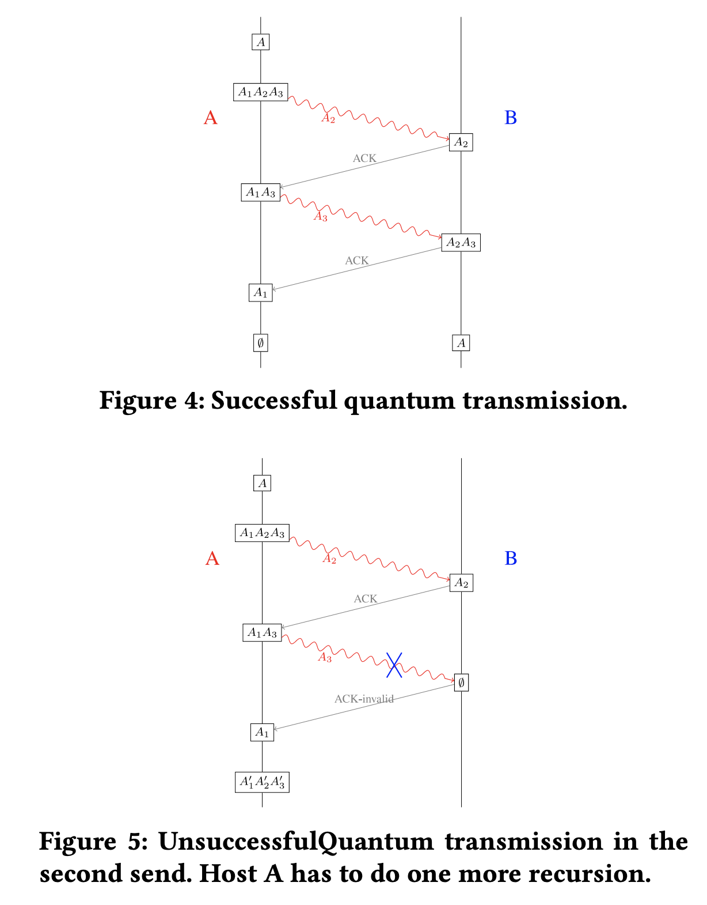

#Transport layer (Protocols for Packet Quantum Network)

## Expectations from the transport layer
* Segmentation -> Segment large chunks of data into smaller data packets depending on the network capacity. In case of a quantum network it would mean the number of qbit pairs that can be allocated between the two nodes.

* Segments - Provide information related to source and dest port no, sequence number of the packets being transmitted.

* Error control -> A transport layer should have some ability for error correction. Given the physical limitations of a quantum networkm, we will have to rely on increasing the redundancy and error correction codes.

* Flow Control-->  Sender and receiver should decide before transmitting the amount of data each can handle in their buffer memory. Transport layer should be able to figure out ideal transmission layer.

##  Difficulties, Challenges and need for different protocol from classical internet for the Quantum internet.

The following challenges call for the need to have seperate protocols for our quantum network

 * Packet loss: It is reasonable to expect that data loss might occur in our quantum networks due to variety of reasons which include quantum decoherence, imperfect operations, the network packet loss, and others. 

 * No Cloning Theorem: Classical networks solve the issue of packet loss by storing the data retranmitting. In case of our quantum networks, we are forbidden by the no-cloning theorem to make copies of our data.  In particular, this affects our problem of transmitting qubits over the internet in two fundamental ways. First, any logical quantum data leak into the environment because the noisy channel cannot be recovered by the communicating parties. Second, the parties hold a joint quantum state that evolves with the protocol, but they cannot make copies of the joint state without corrupting it.
 
 (We will employ the techniques of quantum error correcting code together with the classical techniques of packet design to solve the problem of quantum packet loss)
 
Due to above chalenges and the significant difference between classical bits and quantum bits,the frames of classical TCP/IP cannot be directly applied in a quantum network.

## Transport layer for quantum networks

* Assumption: Assume that all the nodes within the quantum internet can communicate classically, for example, over the classical internet, in order to exchange control information for the quatum internet.

* Quantum Checksum: Quantum checksum is an error detection method that can be used to determine if the data is okay or has incurred any error. function **_f :{0, 1}n  → {0, 1}k_** in the following encoding procedure: a given n-bit string s is encoded as **_(s, f (s)) of (n +k)_**
bits. This has been generalized in quantum computing.

### Quantum User Datagram Protocol (qUDP)

Just like its classical counterpart, UDP, the quantum UDP protocol uses a
simple connectionless communication model with a minimum of protocol mechanism.

Two communicating quantum processes, says Alice and Bob, use classical UDP sockets to interact. After establishing sockets, Alice, the sender at this round, firstly applies the quantum checksum and her qubits are now called the quantum segments, says _n_ qubits. Alice has to apply the joint measurements on her segments and the particles of the EPRs which she would receive from the network layer. This measurement on EPR and quantum segments would now generate a _2n_ -bit string _s_. She now uses the classical checksum on s and sends the resulting classical bits by the classical UDP protocol with following packet structure:
					
					 ------------------------------------------
					| Classical  | UDP header | Indicator Data |
					 ------------------------------------------

Here _Indicator_ is used to indicate that this is qUDP packet of quantum repeater network, allowing receiver to process it accordingly(perform Pauli measurement outcomes, the data part also contains the positions of the corresponding EPRs between two nodes that just been
consumed thus allowing to organize measurement into original data)

#### Sender Protocol for generating UDP packets.

**Input**: register _A_ with _n_ qubits
1. Append **_|0k⟩S_** to _A_ and obtain _AS_;
2. Apply the check unitary Uf
to _AS_ and the resulting _(n + k)_-qubit is now _D_;
3. Ask the Network Layer for collections of EPRs
	**__|Φ⟩A1X1, . . . , |Φ⟩AtXt__**;
 
/* For each _j_, **_|Φ⟩AjXj_** denotes a collection of EPRs with _Aj_ held by Alice and _Xj_ held by
some neighboring router. There should be a
total of _n + k_ EPR pairs. */
4. Divide _D_ into _t_ groups of qubits _D1, . . . ,Dt_
, each _Dj_
with size equal to the number of EPRs in _AjXj_.;
5. Perform Bell measurements on _Dj and _Aj_
correspondingly for _j = 1, . . . ,t_, and record the
measurement outcomes as _s1, . . . ,st_;
6. Construct qUDP packets mj for data (_sj
, j_) for _1 ≤ j ≤ t_, respectively;
7. return _m1, . . . ,mk_ ;

/* In the Network Layer mj will be sent to
the router corresponding to Xj. */

####  Receiver’s action of qUDP packet.

**Input**: qUDP packets _m1, . . . ,mt_

/* _X1, . . . ,Xr_ are the registers of local qubits
of the corresponding EPRs in _m1, . . . ,mt_. */

1. Verify the length and checksum of each _m1, . . . ,mt_;
2. **if** _not valid_ **then**
	  1. drop _m1, . . . ,mt_,and release _X1, . . . ,Xt_; 
3. **else**
	1. Implement the Pauli corrections on _X1, . . . ,Xt_
	according to the data in _m1, . . . ,mt_;
	2. Apply _U−1f_ (reverse of checksum)
	on _X1, . . . ,Xt_ and obtain _AS_;
	3. Measure _S_ in the computational basis;
	4. **if** _Outcome is nonzero_ **then** release _X1, . . ,Xt_ **else** Transmission succeed;
4. return Receiver’s action of qUDP packet;

###  Quantum Transmission Control Protocol (qTCP)

A qTCP would have to provide a connection-oriented, reliable, ordered, and
error-checking delivery of a quantum data stream between
host with guaranteed delivery of application-layer messages to the
destination and flow control.

To guarantee datagram delivery, a quantum version of information retransmission is needed which would have to work around the challenges posed by the no-cloning theorem. 

The qTCP packet is designed as follows:

					 ________________________________  
					
					|	Classical TCP header          |
					|	Indicator                     |
					|	Pseudo acknowledgement number |
					|	Pseudo Window                 |
					|	Data                          | 
					 _________________________________

The indicator implies that this is a qTCP packet for quantum
repeater network. Besides the correction of Pauli measurement outcomes, the data part also contains the positions of  the corresponding EPRs between two nodes that just been consumed. To reach reliable transmission, a packet of quantum information is not transmitted in one step in qTCP, but in at least two stages. Only if the transmission of both parties is successful, the quantum information is successfully transmitted. The Pseudo acknowledgement number and Pseudo Window are used to record the status of the transmission. We will explain the Pseudo acknowledgement number in the following Data transfer part. 

The qTCP protocol operations may be divided into three
phases. 
* The logical process-to-process connections of qTCP is established by a quantum version of the three-way handshake protocol before entering the data transfer phase. 
* Data transfer phase.
* After data transmission is completed, the connection termination  closes established virtual circuits and releases all allocated resources.

#### Quantum three-way handshake.

Just like classical counter part a client (host _A_) initates the establishment of a full duplex channell with a server (host _B_). A quantum three-way handshake protocol operates as follows:

1. **SYN**: Host _A_ establishes _m_ local EPR pairs **_|Φ+⟩A1A2_**
. Host _A_ sends _SYN_ to Host _B_, together with the quantum information of _A2_ (stored as _B2_ by Host _B_) by a
qTCP packet.

2. **SYN-ACK**: Host _B_ receives the qTCP packet. Firstly,
he applies the Pauli correction to _B2_, and then sends
_SYN+1_ to Host _A_, together with the quantum information of _B2_ (stored as _A2_ by _A_). Also, Host _B_ establishes
_m_ local EPR pairs _|Φ+⟩B3B4_
. Then Host _B_ sends _ACK_ to Host _A_, together with the quantum information of _B3_ (stored as _A3_ by _A_) by a qTCP packet. After verifying
_SYN+1_, Host _A_ performs a multi-qubit Bell measurement on A1A2 and checks whether the measurement outcome is _02m_.

3. **ACK**: Host _A_ sends _ACK+1_, and transfers the quantum information of _A3_ to _B3_ of Host _B_. After verifying _ACK+1_, Host _B_ performs a multi-qubit Bell measurement on _B3B4_ and check whether the measurement
outcome is _02m_.

The steps 1, 2 establish the classical and quantum connections
for one direction and it is acknowledged. The steps 2, 3
establish the quantum connection for the other direction
and it is acknowledged. With these, a full-duplex quantum
communication is established

#### Data Retransmission

To handle quantum retransmission, we start with a simple
question: How to achieve reliable transmission of a one-qubit state
_|ψ⟩_ from Host A to Host B through a noisy quantum channel?

A multi-round protocol for retransmission, can  be modelled as follows:
1.  Host _A_ encodes _|ψ⟩_ into _|φ⟩A1A2A3_ , and sends register _A2_ to Host _B_.
2. Host _B_ sends Host _A_ the acknowledgement whether the transmission is successful.
(a) If unsuccessful, the hosts will do other actions.
(b) Otherwise, Host _A_ sends _A3_ to Host _B_.

The reliability requires at least the following fact: once a
transmission failed, the hosts are able to recover the original
state from the remaining qubits.we want an encoding scheme from |ψ⟩ to _|φ⟩A1A2A3_ such that any two of _{A1,A2,A3}_ can reconstruct the unknown _|ψ⟩_. ( An _(k,n)_-
threshold scheme is such that any _k_ shares, but not fewer, _1_
can jointly recover the secret. Above is _(2,3)_)

